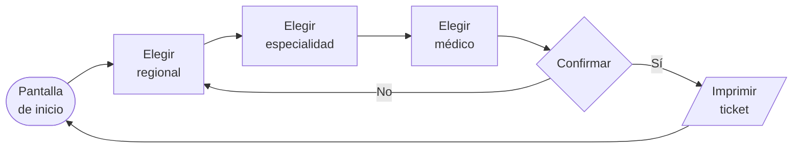

# Ventanilla — Kiosco de autoatención hospitalaria

Terminal táctil que permite al paciente sacar su turno médico e imprimir su ticket sin hacer fila en ventanilla.

Pensado para instalarse en el hall de un hospital: pantalla táctil, flujo de pocos pasos, tipografía grande y respuesta visual inmediata al toque.


---

## El problema

En la ventanilla de un hospital se junta gente para tres cosas distintas: sacar turno, consultar especialidades y preguntar horarios de médicos. Las tres son consultas que no necesitan una persona atrás del vidrio.

Este kiosco absorbe ese flujo: el paciente elige regional → especialidad → médico, confirma, y la terminal le imprime el ticket con su número de turno.

---

## El flujo



Lineal, sin menús anidados, y siempre vuelve al inicio para el siguiente paciente.

---

## Stack

**Frontend** — Next.js (App Router) · TypeScript · Tailwind CSS
**Backend** — NestJS · TypeScript
**Impresión** — generación de ticket vía navegador (`src/lib/printTicket.ts`)

---

## Arquitectura

```
├── src/
│   ├── hooks/
│   │   ├── useEchoTouch.ts        # feedback visual al toque (ripple)
│   │   └── useScreenTransition.ts # transiciones entre pantallas del flujo
│   ├── lib/
│   │   └── printTicket.ts         # composición e impresión del ticket
│   └── mocks/                     # datos de prueba: regionales, especialidades, médicos
│
└── backend/                       # API NestJS
    └── src/
        ├── especialidades/        # catálogo de especialidades médicas
        ├── pacientes/             # consulta de asegurados
        └── turnos/                # asignación y numeración de turnos
```

El backend está modularizado por dominio siguiendo la convención de NestJS: cada módulo con su `controller`, `service` y `module`.

---

## Decisiones de diseño

**Feedback táctil explícito.** En un kiosco público la gente no está segura de si el toque registró, y toca de nuevo. `useEchoTouch` dispara una onda visual en el punto exacto del contacto, lo que corta los toques dobles.

**Pocos pasos, sin retroceso ambiguo.** El flujo es lineal y cada pantalla tiene una sola acción principal. No hay menús anidados.

**Datos mockeados y aislados.** Toda la data de prueba vive en `src/mocks/` detrás de tipos compartidos (`types.ts`), así el frontend se desarrolla y demuestra sin depender del backend ni de datos reales de pacientes.

---

## Correr el proyecto

```bash
# Frontend
npm install
npm run dev          # http://localhost:3000

# Backend
cd backend
npm install
npm run start:dev    # http://localhost:3001
```

---

## Estado

Proyecto funcional en desarrollo. El flujo completo de selección e impresión de turno está implementado sobre datos mock; la integración con el sistema de agenda real queda del lado de la API institucional.

---

**Autor** — [Mauricio Aparicio](https://github.com/astralmau69) · apariciomau3@gmail.com
